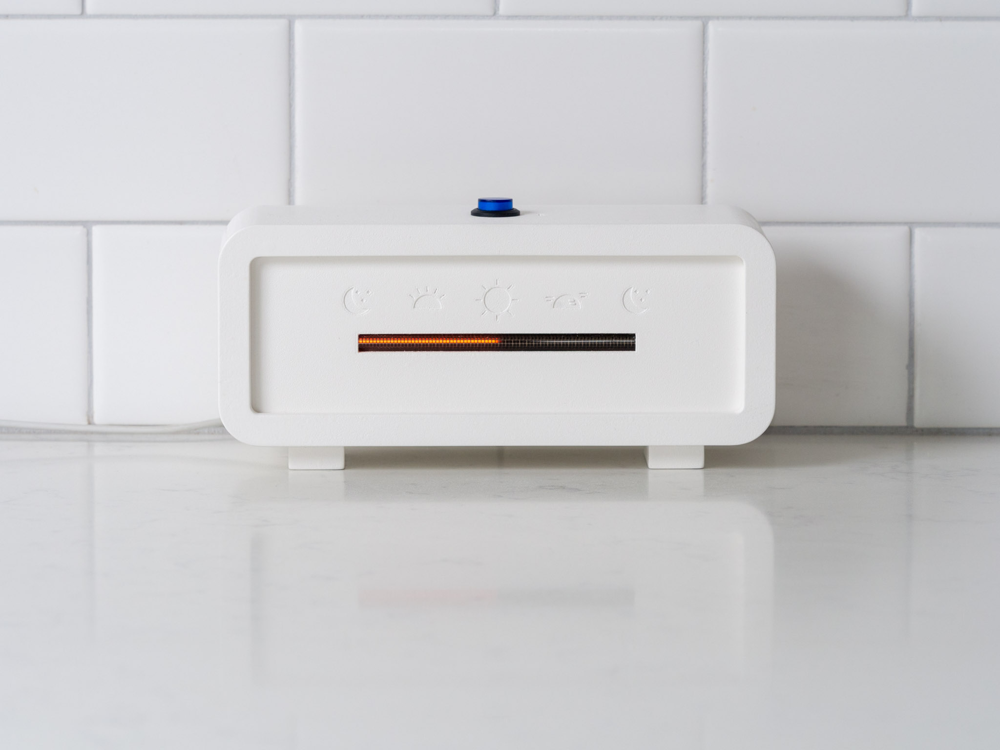

## Introduction

*Leave Time Behind* is experimental timepiece that invites the viewer to have a looser hold on time. The project takes the form of a desk clock that displays time as a continuous glowing bar that advances gradually over the course of the day. Compared to a traditional clock that allows us to obsess over hours and minutes, *Leave Time Behind* only permits the viewer to mark time and intervals approximately in relation to the natural cycle of the day.

The project was inspired by my experiences at Camp Grounded, a tech-free summer camp for adults. One of the rules of camp was to "leave time behind" -- for a weekend, we put away watches, phones, and alarms, and measured time only by the sun and stars.

## Details

The desk clock is primarily an electronic device. A custom printed circuit board (PCB) houses the main components of the electronics design: a switched-mode DC-DC power supply, a microcontroller with Bluetooth low-energy connectivity that keeps time, and a driver circuit that converts the digital time output from the microcontroller to an analog control signal.

The time is displayed on an IN-13 [Nixie tube](https://en.wikipedia.org/wiki/Nixie_tube). By varying the current through the tube, the length of the glowing segment can be controlled. Nixie tubes were chosen for their warm glow and analog aethestic.

When I thought of the design of the clock, I wanted it to have the minimum interface possible. In keeping with the aim to de-emphasize attention to hours and minutes, there are no discrete controls to set the exact time. To set the time, a single button on the top of the enclosure activates the Bluetooth function. When paired with a smartphone, the clock reads the time from the device.

I wanted the clock to work without the need for special wall adapters or connectors, and considered the USB phone charger to be the ideal power adapter that everyone has that could be reused or repurposed. Since USB provides power at 5 VDC, whereas Nixie tubes have a typical firing voltage of 150 - 170 VDC, this required a custom switched-mode DC-DC power supply. The power supply operates in [boost topology](https://en.wikipedia.org/wiki/Boost_converter) in discontinuous current mode (DCM) at a switching frequency of 100 kHz.

## Future work

The clock enclosure was 3D printed from nylon plastic for expediency, but my original concept called for a wood enclosure that would complement the warm, retro aesthetic of the Nixie tube.

An alternative to bootstrapping the time from a smartphone is to use GPS to determine the time relative to local sunrise and sunset. Such a clock could set its own time without any interaction. Since it would display time relative to sunrise and sunset, it need not be concerned with the vagaries of time zones or daylight saving time.

## Understanding this repository

`CAD files`: details of the physical enclosure design including STL files that can be 3D-printed. The enclosure was designed using [Autodesk Fusion 360](https://www.autodesk.com/products/fusion-360/overview).

`PCB`: design files for the printed circuit board, including schematic sheets and layouts. The circuit board was designed using [Altium Designer](https://www.altium.com/altium-designer/). The latest Gerber files for manufacturing are in `Gerbers.zip`. A PDF of the compiled schematic sheets is in `Schematic.pdf`.

`Design scripts` and `spice`: contains various simulation and scripts primarily for the design and tuning of the switching power supply. The simulations use [LTspice](https://www.linear.com/ltspice), a free-to-use SPICE implementation.

`Scope captures`: oscilloscope screen captures documenting the performance and characteristics of the power supply. Most of the captures are annotated with the subject and conditions of the test.

`firmware`: C code for the [nRF5 microcontroller](https://www.nordicsemi.com/).
